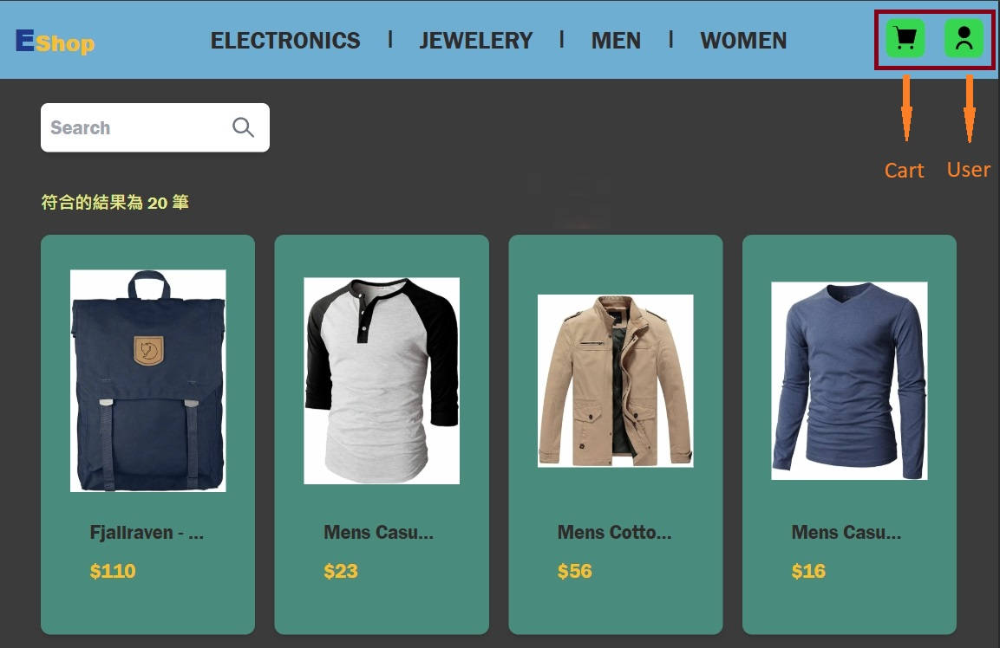

# My E-commerce App

**[中文版](#中文版)**

## English Version

## 📖 Table of Contents

- [Project Introduction](#project-introduction)
- [Features](#features)
- [Live Demo](#live-demo)
- [Tech Stack](#tech-stack)
- [Author Information](#author-information)

---

## 💡 Project Introduction

My E-commerce App is a simulated e-commerce platform designed to showcase the complete workflow of building a modern web application. The project includes core functionalities like product browsing, user login, shopping cart, and order placement, along with backend data storage and form validation.

### ✨ Highlights

- Interactive shopping experience: Users can browse products, add items to the cart, and simulate the checkout process.
- Multiple login methods: Supports Google login and guest access to meet different user needs.
- Member features: Users can view order history and manage frequently used delivery addresses.
- Simulated payment process: Demonstrates form validation and submission without integrating real payment APIs.
- Responsive design: Optimized for both desktop and mobile devices to ensure a consistent user experience.

### 🎯 Purpose

- Learn to develop projects using Next.js:
  - Create a modern web app with Next.js and Supabase.
  - Manage global application state with Redux Toolkit.
  - Build responsive UI and integrate Tailwind CSS for enhanced development efficiency.
  - Use simulated APIs (like FakeAPI) to quickly demonstrate dynamic product data.

### 🌟 Features

- **📦 Product Display**:

  - Search products by keywords in the Search bar.
  - Click on products to view details and add them to the cart.

- **🔐 Icon Overview & Login**:
  

  - **Click User Icon**:

    - Not Logged In:
      - Login: Redirect to the login page.
    - Logged In:
      - Member Center: Redirect to the member center page.
      - Logout: Log out of the account.

  - **Click Cart Icon**: View the shopping cart. If not logged in, it redirects to the login page.
  - **Login**: Supports Google login or guest access for a full experience.
  - **Member Center**: View order history and manage frequently used addresses and stores.

- **🛒 Mock Checkout Process**: 👉 Simulated process, no real payment API 👈
  - **Select Products**: Choose products, adjust quantities, or remove items.
  - **Choose Payment Methods**:
    - Store Pickup with Cash Payment
    - Home Delivery with Cash Payment
    - Home Delivery with Credit Card Payment
  - **Fill in Relevant Information**: Complete the form according to the selected payment method.
  - **Submit Order**: Save the form data to the database.
  - **Order History**: View all order records in the "Member Center."

---

## 🚀 Live Demo

👉 **[Visit the Live App](https://next-eshop-murex.vercel.app)** 👈

---

## 🛠 Tech Stack

- **Frontend**: Next.js, React, Redux Toolkit, TypeScript
- **Backend**: Supabase
- **Styling**: Tailwind CSS

---

## 👤 Author Information

- **Ming Hsu**
- Contact: [n209202003@gmail.com](mailto:n209202003@gmail.com)

---

**[English Version](#english-version)**

## 中文版

## 📖 目錄

- [專案介紹](#專案介紹)
- [功能](#功能)
- [部署網址](#部署網址)
- [技術棧](#技術棧)
- [作者資訊](#作者資訊)

---

## 💡 專案介紹

My E-commerce App 是一個模擬的電子商務平台，旨在展示使用現代 Web 技術構建電商應用的完整流程。本專案包括商品瀏覽、用戶登入、購物車、下單等核心功能，並結合後端數據儲存與表單驗證。

### ✨ 專案亮點

- 互動式購物體驗：用戶可瀏覽商品、加入購物車，模擬真實購物流程。
- 多樣登入方式：支援 Google 登入與訪客體驗，滿足不同用戶需求。
- 會員功能：用戶可檢視訂單記錄、管理常用配送地址。
- 模擬支付流程：雖未集成實際支付 API，但完整展示了支付表單驗證與提交的流程。
- 響應式設計：針對桌面與手機設備進行優化，提供一致的使用體驗。

### 🎯 使用目的

學習使用 Next 開發專案：

- 結合 Next.js 與 Supabase 創建現代化 Web 應用。
- 使用 Redux Toolkit 管理應用全局狀態。
- 構建響應式 UI，並集成 Tailwind CSS 提升開發效率。
- 使用模擬 API (如 FakeAPI) 快速展示產品動態數據。

### 🌟 功能

- **📦 商品展示**：

  - 可在 Search 輸入關鍵字篩選商品。
  - 點擊商品可前往商品詳細頁面，可添加商品至購物車。

- **🔐 Icon 介紹 & 登入**：
  

  - **點擊 User 圖示**：

    - 未登入
      - 登入 : 前往登入頁面。
    - 已登入
      - 會員中心 : 前往會員中心頁面。
      - 登出 : 登出帳號。

  - **點擊 Cart 圖示**：查看購物車，未登入則跳轉至登入頁面。
  - **登入**：支持 Google 授權登入或訪客登入，體驗完整功能。
  - **會員中心**：檢視訂單記錄、管理常用地址&門市。

- **🛒 模擬訂購流程**：👉 僅模擬流程，無實際支付 API👈
  - **選擇商品**：選擇商品、調整商品數量、移除商品。
  - **選擇支付方式**：
    - 超商取貨付款
    - 宅配貨到付款
    - 宅配信用卡付款
  - **填寫相關資訊**：依據支付方式填寫相關資訊表單。
  - **提交訂單**：將表單數據儲存至 DB 內。
  - **訂單紀錄**：訂單記錄可於"會員中心"查看。

---

## 🚀 部署網址

👉 **[前往部署網址](https://next-eshop-murex.vercel.app)** 👈

---

## 🛠 技術棧

- **前端**：Next.js、React、Redux Toolkit、TypeScript
- **後端**：Supabase
- **樣式**：Tailwind CSS

---

## 👤 作者資訊

- **Ming Hsu**
- 聯絡方式：[n209202003@gmail.com](mailto:n209202003@gmail.com)

---
